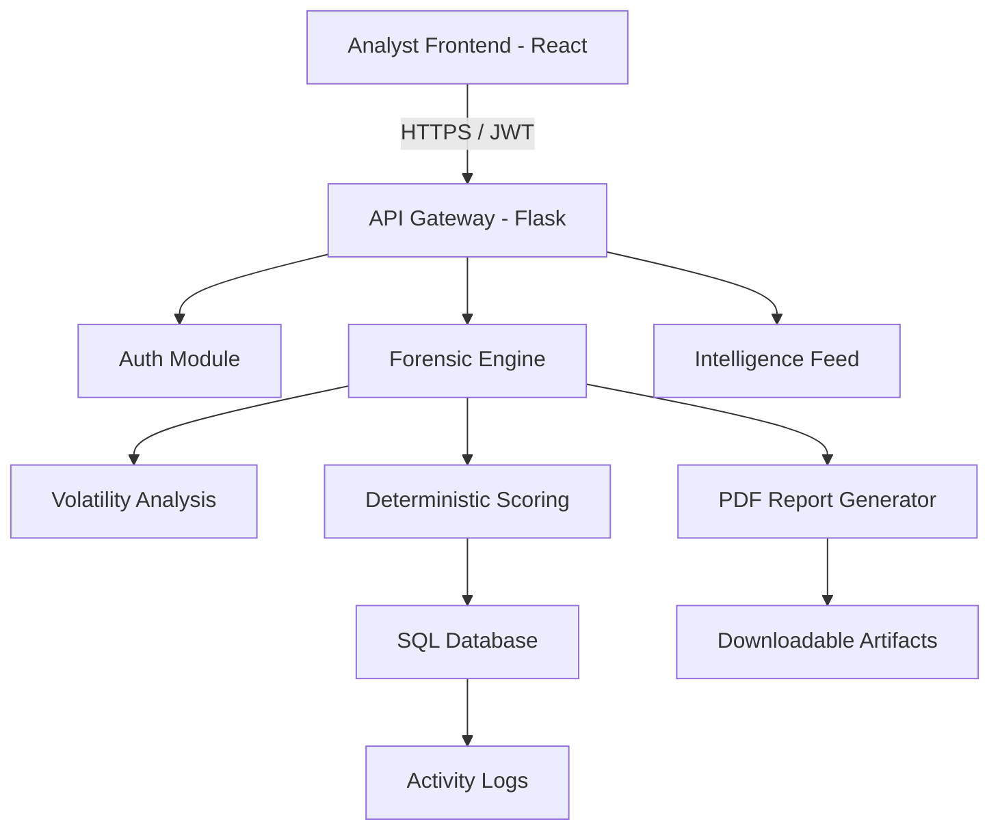

# TRACE – Memory Forensics & Threat Intelligence Platform


[](https://opensource.org/licenses/MIT)
[](https://reactjs.org/)
[](https://flask.palletsprojects.com/)
[](https://github.com/Sreyan-py/TRACE-Memory-Forensics)

> **TRACE** is a premium, enterprise-grade Digital Forensics and Incident Response (DFIR) workstation. It transforms raw memory artifacts into actionable intelligence through a high-fidelity SOC interface, featuring a deterministic forensic engine designed for modern security operations.

---

## 🛡️ Project Overview

TRACE is a comprehensive ecosystem for memory forensics, threat intelligence tracking, and malware inspection. Built to provide analysts with a unified "Command Center" experience, TRACE streamlines the transition from raw data collection to professional forensic reporting.

- **Enterprise DFIR Platform**: Centralized management of forensic investigations.
- **Deterministic Engine**: Guarantees reproducible, hash-based scoring for all artifacts.
- **Elite SOC Dashboard**: Real-time telemetry and global threat pulse visualization.
- **Malware Lab**: Static analysis sandbox for entropy profiling and PE inspection.
- **Threat Intelligence**: Integrated MITRE ATT&CK mapping and CVE tracking.

---

## 👥 Team TRACE

### [Sreyan Swarna](https://github.com/Sreyan-py)
**Role: Platform Architect & Lead Full-Stack Engineer**
- **Frontend Engineering**: Developed the entire "Elite SOC" UI/UX using React and Tailwind CSS.
- **Backend Integration**: Architected the modular Flask API and blueprint system.
- **Platform Architecture**: Designed the end-to-end data flow and deployment strategy.
- **Security Systems**: Implemented the JWT-based authentication and Analyst Identity/Rank system.
- **Module Implementation**: Built the Threat Intel Center, Malware Lab, and Real-time Dashboard widgets.

### [Sunanda Bandi](https://github.com/SunandaBandi)
**Role: Lead Forensic Tooling Engineer**
- **CLI Forensic Tooling**: Developed the initial core CLI for raw memory processing.
- **Forensic Integration**: Managed the integration of Volatility-based processing pipelines.
- **Backend Scan Utilities**: Engineered the scan logic and forensic utility functions.
- **Incident Response Logic**: Defined the detection patterns for suspicious processes and injections.
- **Threat Detection Pipeline**: Optimized the backend data extraction from memory artifacts.

---

## ✨ Features

- **Deterministic Threat Analysis**: Reliable, signature-based scoring with zero randomness.
- **Deep Memory Inspection**: Robust support for `.raw`, `.mem`, `.dmp`, and `.img` artifacts.
- **Malware Analysis Lab**: Static entropy profiling and imported symbol risk assessment.
- **Threat Intelligence Center**: Real-time CVE tracking and MITRE ATT&CK technique mapping.
- **Automated Reporting**: Instant generation of professional PDF forensic reports.
- **Analyst Identity System**: Dynamic rank progression and identity synchronization.
- **SOC-style Interface**: High-density terminal aesthetic with glassmorphism and neon accents.
- **Multi-file Pipeline**: Intelligent routing for Memory, Document, and Archive artifacts.

---

## 🛠️ Tech Stack

### Frontend
- **React 19**: Modern component-based architecture.
- **Tailwind CSS v4**: Advanced utility-first styling with custom cyber-palettes.
- **Recharts**: High-performance data visualization for threat telemetry.
- **Lucide React**: Enterprise-grade iconography.

### Backend
- **Flask (Python)**: Modular API server with blueprint-based routing.
- **SQLAlchemy**: Robust ORM for user identity and scan history management.
- **ReportLab**: Dynamic PDF generation for investigative documentation.

### Cybersecurity Core
- **Volatility 3**: Industry-standard memory analysis framework.
- **SHA256 Hashing**: Integrity-first artifact identification.
- **Deterministic Scoring**: Logic-based threat assessment engine.

---

## 🏗️ System Architecture



---

## ⚙️ Installation & Setup

### 1. Backend Setup
```bash
cd backend
python -m venv venv
source venv/bin/activate  # Windows: venv\Scripts\activate
pip install -r requirements.txt
python scripts/seed_db.py # Initialize analyst database
python app.py
```

### 2. Frontend Setup
```bash
cd frontend
npm install
npm run dev
```

---

## 🔬 Deterministic Engine
TRACE eliminates the "black box" of threat scoring. By utilizing hash-based caching and deterministic logic, the same uploaded sample will always generate the same forensic result. This ensures:
- **Reproducibility**: Peer-reviewable forensic findings.
- **Efficiency**: Instant results for previously analyzed artifacts.
- **Auditability**: Clear mapping between artifact signatures and threat scores.


## 🔮 Future Improvements
- **Live SIEM Integration**: Direct ingestion from Splunk and ELK stacks.
- **Distributed Scan Nodes**: Parallelized processing for massive memory dumps.
- **AI-Assisted Classification**: Neural-link assisted malware family identification.
- **Collaborative Investigation Rooms**: Multi-analyst real-time forensic collaboration.

---

## 📜 License
Distributed under the MIT License. See `LICENSE` for more information.

---
**TRACE - Stabilizing the future of Digital Forensics.**
